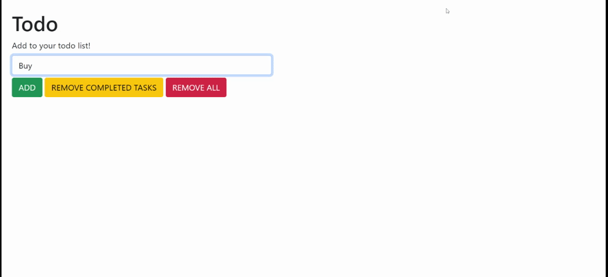

# To Do: DOM

> In this assignment, we'll be creating a to do list... from scratch! 
> 
> Feel free to take creative liberties with the design and user interface of your application.

## An example finished product

## Requirements

* You make at least 3 commits in git
* Your project is hosted on GitHub Pages
* Users have the ability to add new to-do items
* Users have the ability to view to-do items
* Allow users to clear all to-do items

## Stretch goals

* Users have the ability to toggle the completion of to-do items
* Allow users to delete individual to-do items
* Allow users to edit existing to-do items
